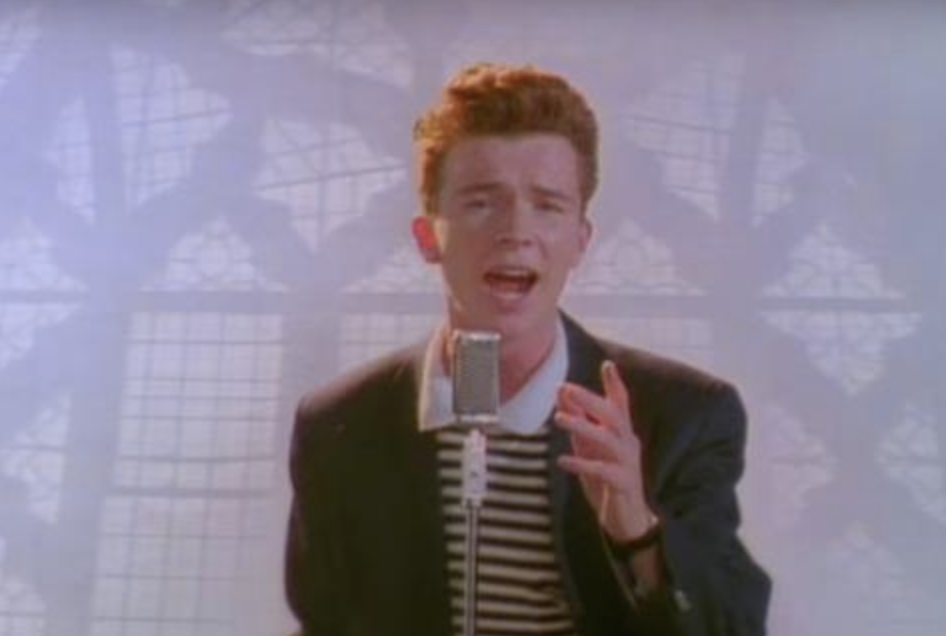

<!DOCTYPE html>
<html lang="en">
    <head> 
        <link rel="icon" href="favicon.png" type="image/png">
        <link rel="shortcut icon" href="favicon.png" type="image/png">
        <title> Rick Astley Tribute! </title>
    </head>

    <body>
        <h1> He will never give you up, or let you down! </h1>
        

        <h2> Bio </h2>
        
 Richard Paul Astley (born 6 February 1966) is an English singer, songwriter and radio personality. He rose to fame through his association with the production trio Stock Aitken Waterman; his 1987 recording of their song "Never Gonna Give You Up" was a number 1 hit single in 25 countries, winning the 1988 Brit Award for Best British Single. By the time of his retirement in 1993, Astley had sold approximately 40 million records worldwide. 

        

        Follow him on Facebook here:
        <a href="https://www.facebook.com/RickAstley" target="_blank" > Rick Astley</a>
        

        <table> 
            <th> Albums </th>
            <tr>
                <td> Whenever You Need Somebody: (1987)  </td>
            </tr>
            <tr>
                <td> Hold Me in Your Arms:  (1988) </td>
            </tr>
            <tr>
                <td> Free: (1991) </td>
            </tr>
            <tr>
                <td> Body & Soul: (1993) </td>
            </tr>
            <tr> 
                <td> Keep It Turned On: (2001) </td>
            </tr>
            <tr>
                <td> Portrait: (2005)  </td>
            </tr>
            <tr>
                <td> 50: (2016) </td>
                
            </tr>
            <tr>
                <td> Beautiful Life: (2018) </td>
            </tr>
            <tr>
                <td> The Best of Me: (2019) </td>
            </tr>
        </table>
        <h2> Favorite Song: </h2>

       <!--https://www.youtube.com/watch?v=dQw4w9WgXcQ -->

        <iframe width="560" height="315" src="https://www.youtube.com/embed/dQw4w9WgXcQ" frameborder="0" allow="accelerometer; autoplay; encrypted-media; gyroscope; picture-in-picture" allowfullscreen></iframe>

        

    </body>

</html>
